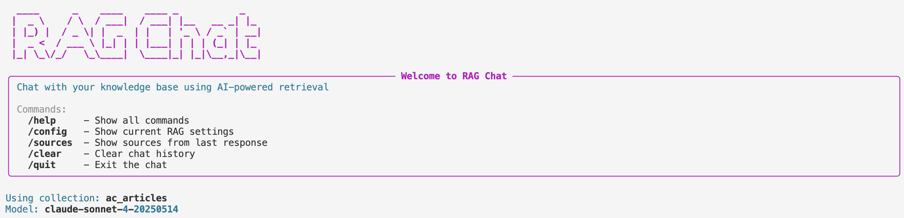

# ChromaDB RAG example

A simple RAG (Retrieval-Augmented Generation) system for ingesting markdown blog posts into ChromaDB and chatting with your knowledge base using Claude.

**This is a companion app this [post](https://open.substack.com/pub/alteredcraft0/p/two-years-of-writing-one-afternoon?r=6xi9d&utm_campaign=post&utm_medium=web&showWelcomeOnShare=true) on Altered Craft**

## Features

- Ingest markdown files with YAML frontmatter
- Token-based chunking with sliding window overlap
- Interactive CLI chat powered by Claude (Anthropic)
- Switchable storage backend (local or cloud) via environment variables
- ChromaDB's default embedding model (all-MiniLM-L6-v2)
- RSS sync for pulling new articles from alteredcraft.com

## Installation

Requires Python 3.13+ and [uv](https://docs.astral.sh/uv/).

```bash
uv sync
```

## Quick Start

```bash
# 1. Copy the environment template and add your API key
cp dist.env .env
# Edit .env and set ANTHROPIC_API_KEY

# 2. Ingest some markdown files
uv run python ingest.py ./articles

# 3. Start chatting!
uv run python chat.py chat
```

## Tests

```bash
uv run pytest
```

## Usage

### Interactive Chat

Start an interactive chat session with your knowledge base:

```bash
# Basic usage
uv run python chat.py chat

# With options
uv run python chat.py chat \
  --collection blog_posts \
  --n-results 5 \
  --min-relevance 0.5 \
  --type deep_dive
```



### Single Query Mode

Ask a single question without entering interactive mode:

```bash
uv run python chat.py query "What are the best practices for building AI agents?"
```

### Ingest Markdown Files

```bash
# Ingest all .md files from articles directory
uv run python ingest.py ./articles

# Specify a custom collection name
uv run python ingest.py ./articles my_collection

# Ingest without chunking (entire doc = 1 chunk)
uv run python ingest.py ./articles --no-chunk
```

### Query the Database Programmatically

```python
from chroma_client import get_chroma_client

client = get_chroma_client()
collection = client.get_collection("blog_posts")

results = collection.query(
    query_texts=["How do I build an AI agent?"],
    n_results=3
)

for doc, meta in zip(results["documents"][0], results["metadatas"][0]):
    print(f"Source: {meta['source_file']}")
    print(f"Content: {doc[:200]}...")
```

## Configuration

### Environment Variables

Copy `dist.env` to `.env` and configure:

```bash
cp dist.env .env
```

| Variable | Description | Default |
|----------|-------------|---------|
| `ANTHROPIC_API_KEY` | Anthropic API key (required for chat) | - |
| `ANTHROPIC_MODEL` | Claude model to use | `claude-sonnet-4-20250514` |
| `SYSTEM_PROMPT_FILE` | Path to system prompt file | `prompt.txt` |
| `CHAT_LOG_FILE` | Path to debug log file | `chat.log` |
| `CHAT_LOG_LEVEL` | Log level (DEBUG, INFO, WARNING, ERROR) | `DEBUG` |
| `CHROMA_CLIENT_TYPE` | `persistent` or `cloud` | `persistent` |
| `CHROMA_PERSIST_PATH` | Local storage path | `./.chromadb` |
| `CHROMA_TENANT` | Cloud tenant ID | - |
| `CHROMA_DATABASE` | Cloud database name | - |
| `CHROMA_API_KEY` | Chroma Cloud API key | - |

### Using Chroma Cloud

```bash
export CHROMA_CLIENT_TYPE=cloud
export CHROMA_TENANT=your-tenant-id
export CHROMA_DATABASE=your-database-name
export CHROMA_API_KEY=your-api-key

uv run python ingest.py ./articles
```

## Project Structure

```
.
├── chat.py             # Interactive RAG chat CLI
├── chroma_client.py    # Client factory (persistent/cloud)
├── ingest.py           # Markdown ingestion logic
├── prompt.txt          # System prompt for Claude (customizable)
├── scripts/
│   └── sync_articles.py # Sync articles from RSS feed
├── articles/           # Markdown articles
├── tests/              # Unit tests
├── dist.env            # Environment template
├── chat.log            # Debug log file (auto-created)
├── .chromadb/          # Local database (auto-created)
└── pyproject.toml
```

## Markdown Format

Articles use YAML frontmatter:

```markdown
---
author: Sam Keen
publish_date: January 15, 2024
title: My Article
type: weekly_review
url: https://alteredcraft.com/p/my-article
---

# My Article

Introduction...

## Section One

Content...
```

The ingester extracts frontmatter as metadata and chunks content using a sliding window tokenizer (256 tokens max, 50 token overlap).
